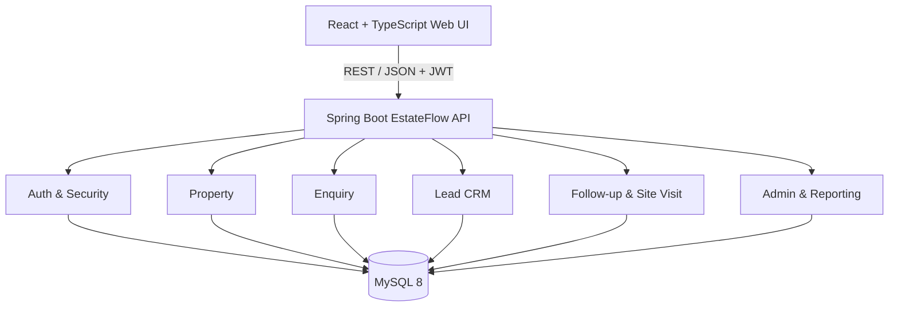

# EstateFlow - System Architecture

## 1. Architecture Decision
EstateFlow uses a **modular monolith** for the one-week MVP.

Why:
- The assignment requires a working module, not a distributed microservice platform.
- A modular monolith minimizes deployment and operational overhead.
- Domain boundaries are explicit so modules can be extracted later if scale requires it.
- The backend remains the strongest technical component of the submission.

## 2. Technology Stack
- Java 17
- Spring Boot 4.x
- Spring Web
- Spring Security
- JWT authentication
- Spring Data JPA
- Bean Validation
- MySQL 8
- Flyway database migrations
- springdoc-openapi / Swagger UI
- JUnit 5 + Mockito
- Testcontainers for selected integration tests
- Docker / Docker Compose
- React + TypeScript frontend
- Redis: optional enhancement only

## 3. High-Level Architecture



## 4. Backend Module Structure

```text
com.estateflow
├── auth
├── user
├── property
├── shortlist
├── enquiry
├── lead
├── visit
├── reporting
├── security
└── common
```

Each business module may contain controller, dto, entity, repository, service, mapper and module-specific exceptions.

## 5. Request Flow

```text
HTTP Request
  -> Controller
  -> Request DTO + Validation
  -> Service / Business Rules
  -> Repository
  -> MySQL

MySQL
  -> Entity
  -> Mapper
  -> Response DTO
  -> JSON Response
```

Controllers remain thin. JPA entities are not exposed directly as API responses.

## 6. Security
Roles:
- BUYER
- OWNER
- AGENT
- BUILDER
- ADMIN

Security uses both:
1. Role-based authorization.
2. Resource ownership/business authorization.

Example: an OWNER may edit their own listing but not another owner's listing.

## 7. Cross-Cutting Concerns
- Global exception handling
- Standard API error format
- DTO validation
- Pagination and sorting
- Auditing: created_at and updated_at
- Structured logging
- OpenAPI documentation
- Database migrations through Flyway
- Transaction boundaries at service layer

## 8. Future Scaling
Do not implement these as separate services during the MVP. If future load or team boundaries justify extraction, candidates include:
- Property/Search Service
- Lead/CRM Service
- Notification Service
- Media Service
- Reporting Service
