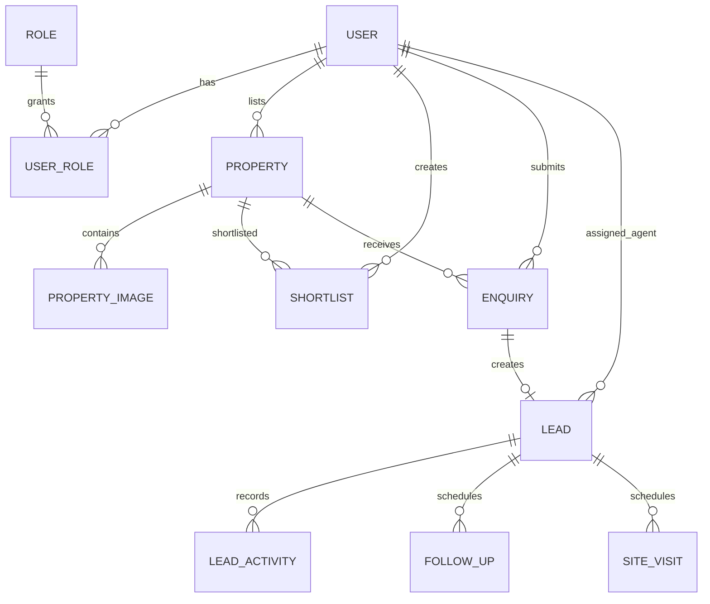

# EstateFlow - Database Design

## 1. Design Principles
- MySQL 8 relational model.
- BIGINT AUTO_INCREMENT internal primary keys.
- DECIMAL for monetary values.
- Foreign keys for referential integrity.
- created_at / updated_at on important mutable entities.
- Business validation in Java plus database constraints where practical.
- Index only known query paths.

## 2. ER Model

## 3. Tables

### users
- id BIGINT PK
- full_name VARCHAR(120) NOT NULL
- email VARCHAR(190) NOT NULL UNIQUE
- phone VARCHAR(20) UNIQUE
- password_hash VARCHAR(255) NOT NULL
- status ENUM('ACTIVE','INACTIVE','SUSPENDED') NOT NULL
- created_at DATETIME NOT NULL
- updated_at DATETIME NOT NULL

Indexes: email unique, phone unique, status.

### roles
- id BIGINT PK
- name ENUM('BUYER','OWNER','AGENT','BUILDER','ADMIN') NOT NULL UNIQUE

### user_roles
- user_id BIGINT FK -> users.id
- role_id BIGINT FK -> roles.id
- PRIMARY KEY(user_id, role_id)

### properties
- id BIGINT PK
- listed_by_user_id BIGINT NOT NULL FK -> users.id
- title VARCHAR(180) NOT NULL
- description TEXT
- property_type ENUM('APARTMENT','HOUSE','VILLA','PLOT','OFFICE','SHOP','OTHER') NOT NULL
- listing_type ENUM('SALE','RENT') NOT NULL
- price DECIMAL(15,2) NOT NULL
- area_sqft DECIMAL(10,2)
- bedrooms TINYINT
- bathrooms TINYINT
- parking_spaces TINYINT
- address_line VARCHAR(255)
- locality VARCHAR(120) NOT NULL
- city VARCHAR(120) NOT NULL
- state VARCHAR(120) NOT NULL
- postal_code VARCHAR(20)
- latitude DECIMAL(10,7)
- longitude DECIMAL(10,7)
- status ENUM('DRAFT','PENDING_APPROVAL','PUBLISHED','REJECTED','ARCHIVED') NOT NULL
- verified BOOLEAN NOT NULL DEFAULT FALSE
- created_at DATETIME NOT NULL
- updated_at DATETIME NOT NULL

Indexes:
- (status, city)
- (city, locality)
- property_type
- listing_type
- price
- bedrooms
- listed_by_user_id

### property_images
- id BIGINT PK
- property_id BIGINT NOT NULL FK -> properties.id
- image_url VARCHAR(500) NOT NULL
- display_order INT NOT NULL DEFAULT 0
- is_primary BOOLEAN NOT NULL DEFAULT FALSE
- created_at DATETIME NOT NULL

Index: property_id.

### shortlists
- id BIGINT PK
- user_id BIGINT NOT NULL FK -> users.id
- property_id BIGINT NOT NULL FK -> properties.id
- created_at DATETIME NOT NULL
- UNIQUE(user_id, property_id)

### enquiries
- id BIGINT PK
- property_id BIGINT NOT NULL FK -> properties.id
- buyer_user_id BIGINT NOT NULL FK -> users.id
- message VARCHAR(1000)
- source ENUM('PROPERTY_PAGE','SEARCH','OTHER') NOT NULL DEFAULT 'PROPERTY_PAGE'
- status ENUM('NEW','PROCESSED','CLOSED') NOT NULL
- created_at DATETIME NOT NULL
- updated_at DATETIME NOT NULL

Indexes: property_id, buyer_user_id, status, created_at.

### leads
- id BIGINT PK
- enquiry_id BIGINT NOT NULL UNIQUE FK -> enquiries.id
- assigned_agent_id BIGINT NULL FK -> users.id
- stage ENUM('NEW','CONTACTED','QUALIFIED','VISIT_SCHEDULED','VISIT_COMPLETED','FOLLOW_UP','NEGOTIATION','CONVERTED','LOST') NOT NULL
- priority ENUM('LOW','MEDIUM','HIGH') NOT NULL DEFAULT 'MEDIUM'
- lost_reason VARCHAR(500)
- converted_at DATETIME
- version BIGINT NOT NULL DEFAULT 0
- created_at DATETIME NOT NULL
- updated_at DATETIME NOT NULL

Indexes:
- stage
- assigned_agent_id
- (assigned_agent_id, stage)
- priority
- created_at

`version` supports optimistic locking.

### lead_activities
- id BIGINT PK
- lead_id BIGINT NOT NULL FK -> leads.id
- performed_by_user_id BIGINT NOT NULL FK -> users.id
- activity_type ENUM('CREATED','ASSIGNED','STAGE_CHANGED','NOTE_ADDED','FOLLOW_UP_CREATED','VISIT_SCHEDULED','VISIT_UPDATED') NOT NULL
- description VARCHAR(1000) NOT NULL
- old_stage VARCHAR(40)
- new_stage VARCHAR(40)
- created_at DATETIME NOT NULL

Indexes: (lead_id, created_at).

### follow_ups
- id BIGINT PK
- lead_id BIGINT NOT NULL FK -> leads.id
- assigned_to_user_id BIGINT NOT NULL FK -> users.id
- scheduled_at DATETIME NOT NULL
- status ENUM('PENDING','COMPLETED','CANCELLED') NOT NULL
- note VARCHAR(1000)
- completed_at DATETIME
- created_at DATETIME NOT NULL
- updated_at DATETIME NOT NULL

Indexes: (assigned_to_user_id, status, scheduled_at), lead_id.

### site_visits
- id BIGINT PK
- lead_id BIGINT NOT NULL FK -> leads.id
- scheduled_by_user_id BIGINT NOT NULL FK -> users.id
- scheduled_at DATETIME NOT NULL
- status ENUM('SCHEDULED','COMPLETED','CANCELLED','NO_SHOW') NOT NULL
- feedback VARCHAR(1500)
- completed_at DATETIME
- created_at DATETIME NOT NULL
- updated_at DATETIME NOT NULL

Indexes: (status, scheduled_at), lead_id.

## 4. Important Cardinalities
- User 1:N Property
- Property 1:N PropertyImage
- User N:M Property through Shortlist
- User 1:N Enquiry
- Property 1:N Enquiry
- Enquiry 1:0..1 Lead
- Agent(User) 1:N Lead
- Lead 1:N LeadActivity
- Lead 1:N FollowUp
- Lead 1:N SiteVisit

## 5. MVP Decisions
- A listing is owned/listed by one user. OWNER and BUILDER are represented through roles.
- One enquiry may produce at most one lead.
- Lead is an independent CRM aggregate even though it originates from an enquiry.
- Full builder project/tower/unit inventory is future scope.
- Media storage keeps URLs in MySQL; binary image data is not stored in the database.
